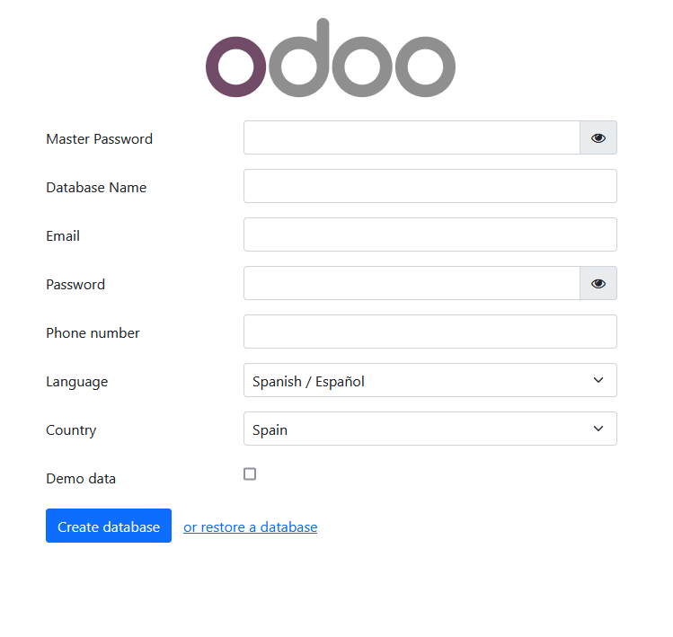
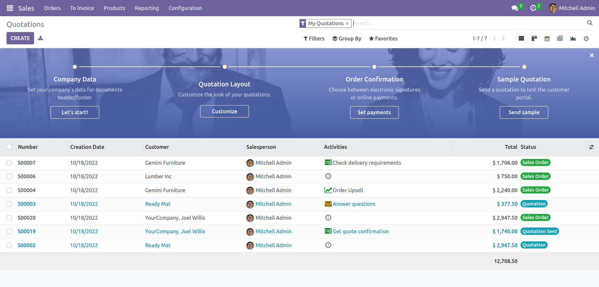

# Desplegar multiples instancias Odoo 16.0, con Docker Compose, en servidor Linux Ubuntu.

## Instalación rápida en servidor linux Unbuntu

Instalar [docker](https://docs.docker.com/get-docker/) y [docker-compose](https://docs.docker.com/compose/install/).
Si `curl` no está disponible, instalar:
``` bash
$ sudo apt-get install curl
# o bien
$ sudo yum install curl
```
Ejecutar siguiente `curl` para configurar la primera instancia de Odoo @ `localhost:10001` (`master password` por defecto: `jorgegr.com`):
``` bash
curl -s https://raw.githubusercontent.com/JorgeGijon/Instalar_Odoo_Docker_Compose/main/run.sh | sudo bash -s odoo-01 10001 20001
```
y/o ejecute el siguiente para configurar otra instancia Odoo @ `localhost:10002` (`master password` por defecto: `jorgegr.com`):
``` bash  run.sh
curl -s https://raw.githubusercontent.com/JorgeGijon/Instalar_Odoo_Docker_Compose/main/run.sh | sudo bash -s odoo-02 10002 20001
```

Argumentos:
* **odoo-01**: carpeta de implementación de Odoo
* **10001**:    puerto Odoo
* **20001**:    puerto live chat `opcional`


## Uso

Inicie el contenedor:
``` sh
docker-compose up
```
Luego abra `localhost:10001` para acceder a Odoo 16.0.

- **Si tiene algún problema con los permisos**, cambie el permiso de la carpeta para asegurarse de que el contenedor pueda acceder al directorio:

``` sh
$ sudo chmod -R 777 addons
$ sudo chmod -R 777 etc
$ sudo chmod -R 777 postgresql
```

- Si desea iniciar el servidor con un puerto diferente, cambie **10001** a otro valor en **docker-compose.yml** dentro del directorio principal:

```
puertos:
 - "10001:8069"
```

- Para ejecutar el contenedor Odoo en modo independiente (y poder cerrar la terminal sin detener Odoo):

```
docker-compose up -d
```

- Para utilizar una política de reinicio, es decir, configurar la política de **reinicio** para un contenedor, cambie el valor relacionado con la clave de **reinicio** en el archivo **docker-compose.yml** a uno de los siguientes:
   - `no` =	No reinicie automáticamente el contenedor. (el valor por defecto)
   - `on-failure[:max-retries]` = Reinicie el contenedor si sale debido a un error, que se manifiesta como un código de salida distinto de cero. Opcionalmente, limite la cantidad de veces que el `daemon` Docker intenta reiniciar el contenedor usando la opción `:max-retries`.
  - `always` =	Reinicie siempre el contenedor si se detiene. Si se detiene manualmente, se reinicia solo cuando se reinicia el demonio Docker o cuando se reinicia manualmente el contenedor. (Consulte la segunda viñeta que figura en los detalles de la política de reinicio)
  - `unless-stopped`	= Similar a `always`, excepto que cuando el contenedor se detiene (manualmente o de otra manera), no se reinicia incluso después de que se reinicia el `daemon` Docker.
```
 restart: always             # correr como un servicio
```

- Para aumentar el número máximo de archivos que se ven de 8192 (predeterminado) a **524288** . Para evitar errores cuando ejecutamos múltiples instancias de Odoo. `Este es un paso opcional` . Estos comandos son para usuarios de Ubuntu:

```
$ if grep -qF "fs.inotify.max_user_watches" /etc/sysctl.conf; then echo $(grep -F "fs.inotify.max_user_watches" /etc/sysctl.conf); else echo "fs.inotify.max_user_watches = 524288" | sudo tee -a /etc/sysctl.conf; fi
$ sudo sysctl -p    # apply new config immediately
``` 

## Complementos personalizados

La carpeta **addons/** contiene complementos personalizados. Simplemente coloque sus complementos personalizados si tiene alguno.

## Configuración y registro de Odoo

* Para cambiar la configuración de Odoo, edite el archivo: **etc/odoo.conf**.
* Log file: **etc/odoo-server.log**
* La contraseña por defecto de la BD (**admin_passwd**) es `jorgegr.com`, puede cambiarse en @ [etc/odoo.conf#L60](/etc/odoo.conf#L60)

## Gestión de contenedores Odoo

**Ejecute Odoo**:

``` bash
docker-compose up -d
# o bien
$ sudo docker ps
$ sudo docker start [contenedor_Id]
```

**Reiniciar Odoo**:
``` bash
docker-compose restart
# o bien
$ sudo docker ps
$ sudo docker restart [contenedor_Id]
```

**Detener Odoo**:
``` bash
docker-compose down
# o bien
$ sudo docker ps
$ sudo docker stop [contenedor_Id]
```

**Eliminar Odoo**:
``` bash
docker-compose down
# o bien
$ sudo docker ps
$ sudo docker rm [contenedor_Id]
```

**Eliminar Carpeta Odoo**:
``` bash
$ sudo rm -r odoo-01  #borrar carpeta contenedora
```

<!--
## Live chat

En [docker-compose.yml#L21](docker-compose.yml#L21), expusimos el puerto **20001** para chat.

Configuración [nginx](https://www.nginx.com/resources/wiki/start/topics/tutorials/install/) para activar la función de chat (en producción):

``` conf
#...
server {
    #...
    location /longpolling/ {
        proxy_pass http://0.0.0.0:20001/longpolling/;
    }
    #...
}
#...
```
-->

## docker-compose.yml

* odoo:16.0
* postgres:15

## Capturas de pantalla de Odoo 16.0 después de desplegar




<!--



-->